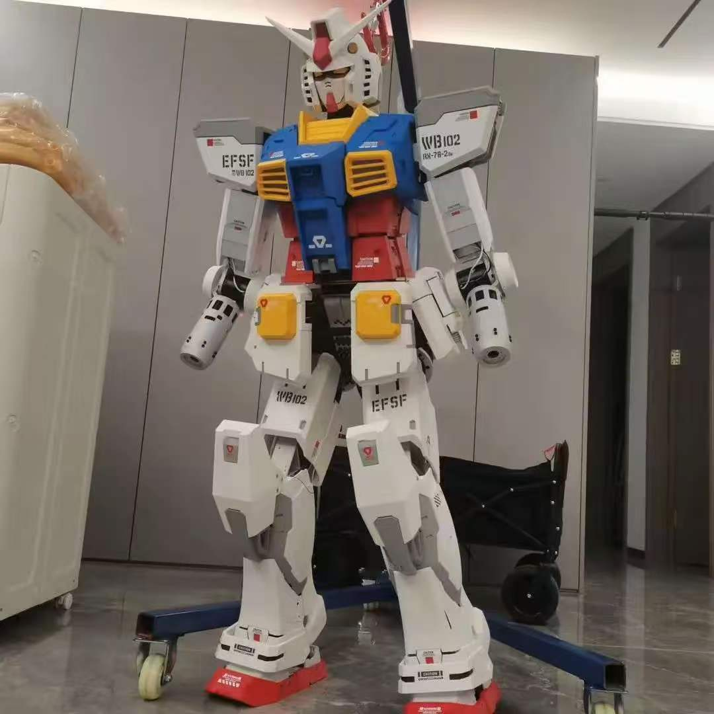

<!-- ╔══════════════════════════════════════════════════════════════╗
     ║   AI指挥官Felix · Cyberpunk Profile · 2026
     ╚══════════════════════════════════════════════════════════════╝ -->

<div align="center">

<!-- 顶部霓虹横幅 -->


<!-- 头像：机甲 + 霓虹光晕 -->


<!-- 品牌名 + 徽章 -->
<h1>
  <span style="color:#00f0ff;">AI</span><span style="color:#ff00ff;">指挥官</span><span style="color:#00f0ff;">Felix</span>
</h1>

<a href="https://github.com/ShuaixinHuang"></a>


</div>

---

<!-- 终端风格自我介绍 -->
<div align="center">

`felix@ai-commander:~$ whoami`

</div>

```python
class Felix:
    """AI指挥官Felix // 全网同名"""
    role      = "开源项目自媒体博主"
    identity  = "24级人工智能专业学生"
    research  = "人形机器人算法"
    stack     = ["Python", "MATLAB", "PyTorch"]
    focus     = ["感知", "决策", "运动控制"]
    mission   = "记录开源世界，分享AI探索"

    def say_hi(self):
        return "欢迎来到我的数字基地 ⚡"

felix = Felix()
print(felix.say_hi())
```

---

<!-- 核心身份卡片 -->
<div align="center">

<h3>✦ 三重身份 ✦</h3>

<table>
<tr>
<td align="center" width="33%"><b>🎓 学生</b><br/><sub>人工智能专业<br/>技术探索者</sub></td>
<td align="center" width="33%"><b>📡 博主</b><br/><sub>开源项目自媒体<br/>全网同名</sub></td>
<td align="center" width="33%"><b>🤖 研究者</b><br/><sub>人形机器人算法<br/>感知·决策·控制</sub></td>
</tr>
</table>

</div>

---

<!-- 作品展示：视频原生播放（user-attachments URL） -->
<div align="center">

<h3>▶ 作品展示</h3>

<video src="https://github.com/user-attachments/assets/99ea5725-cdc0-4984-9fa2-3b51855b9654" controls width="720"></video>

<p><sub>⚡ Humanoid Robot Demo · 人形机器人演示</sub></p>

</div>

---

<!-- 内容矩阵 · 居中表格 -->
<div align="center">

<h3>✎ 内容矩阵</h3>

<table>
<tr>
<th align="center">日期</th>
<th align="center">标题</th>
<th align="center">标签</th>
</tr>
<tr>
<td align="center"><code>2026</code></td>
<td align="center"><b>人形机器人算法实战</b> · 感知与运动控制探索记录</td>
<td align="center"><code>机器人</code></td>
</tr>
<tr>
<td align="center"><code>2026</code></td>
<td align="center"><b>开源项目解读系列</b> · 拆解设计思路与实现细节</td>
<td align="center"><code>开源</code></td>
</tr>
<tr>
<td align="center"><code>2026</code></td>
<td align="center"><b>AI 前沿观察</b> · 跟踪算法与工程落地</td>
<td align="center"><code>AI</code></td>
</tr>
<tr>
<td align="center"><code>2026</code></td>
<td align="center"><b>自媒体创作手记</b> · 做开源内容这件事的点滴</td>
<td align="center"><code>创作</code></td>
</tr>
</table>

</div>

---

<!-- 📌 精选项目（Pinned） -->
<div align="center">

<h3>📌 精选项目</h3>

<table>
<tr>
<td width="50%" align="center">
<a href="https://github.com/ShuaixinHuang/Janus-Pro"><b>🔧 Janus-Pro</b></a><br/>
<sub>Janus-Pro 一键部署</sub><br/><br/>


</td>
<td width="50%" align="center">
<a href="https://github.com/ShuaixinHuang/image-multiple-angles-3d-camera"><b>🎬 image-multiple-angles-3d-camera</b></a><br/>
<sub>多角度3D相机视角图像生成</sub><br/><br/>


</td>
</tr>
</table>

</div>

---

<!-- 技能矩阵 -->
<div align="center">

<h3>⚙ 技能矩阵</h3>


<br/><br/>


</div>

---

<!-- GitHub 统计 -->
<div align="center">

<h3>📊 数据面板</h3>


<br/>


<br/><br/>


</div>

---

<!-- 全网同名 -->
<div align="center">

<h3>📡 全网同名 · AI指挥官Felix</h3>

<a href="https://github.com/ShuaixinHuang"></a>


</div>

---

<!-- 底部 -->
<div align="center">


<br/><br/>

> ⚡ *"Stay curious, keep building."* — AI指挥官Felix

<br/>

<!-- 贡献活动热力图 -->
<h3>🔥 贡献活动</h3>


<br/>


</div>
